# AgriSmart App

## Project Title
**AgriSmart** – Smart Agriculture Assistant  

---

## Description
AgriSmart is an Android application designed to assist farmers by providing:
- Weather-based irrigation planning  
- Crop health monitoring using NDVI/NDRE and nutrient maps  
- Crop disease detection and recommendations  
- Integration with machine learning models for predictive analysis  

The app aims to improve crop yield and optimize resource usage for farmers.  

---

## Problem Statement
Farmers often lack accurate data and timely insights about:
- Soil health and nutrient status  
- Crop stress detection  
- Weather forecasts for irrigation planning  

AgriSmart addresses these problems by leveraging IoT, remote sensing, and machine learning technologies to provide actionable insights in a simple mobile app.  

---

## App Screenshots

### Home & Dashboard
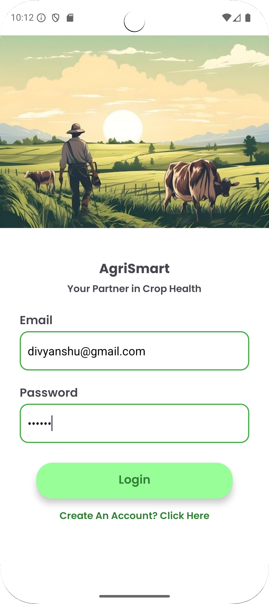
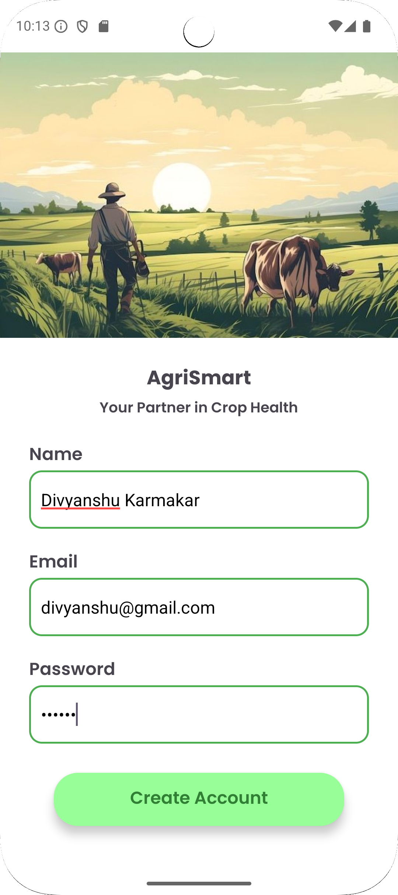
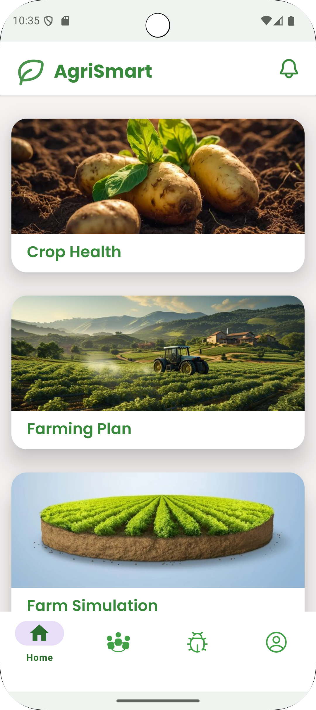
<!-- Repeat for all remaining screenshots -->
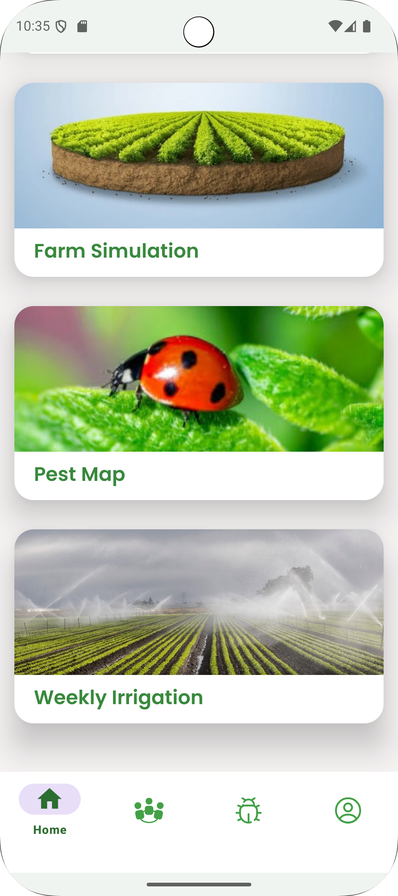

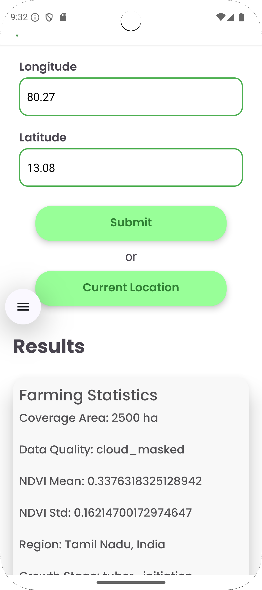
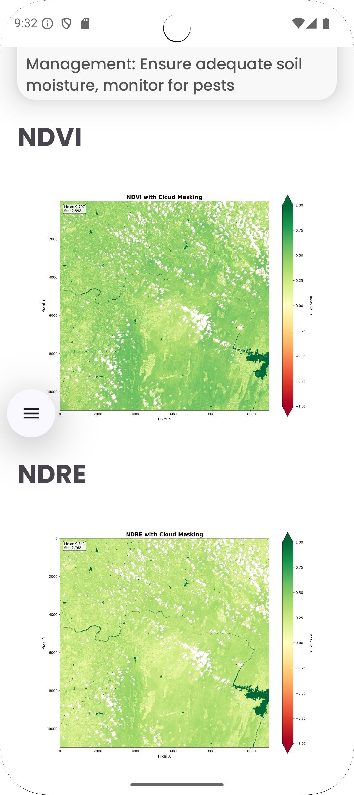
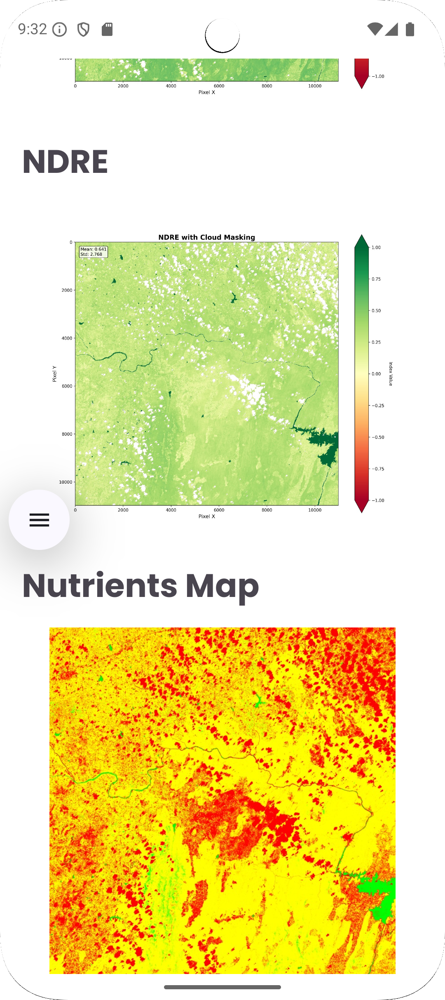
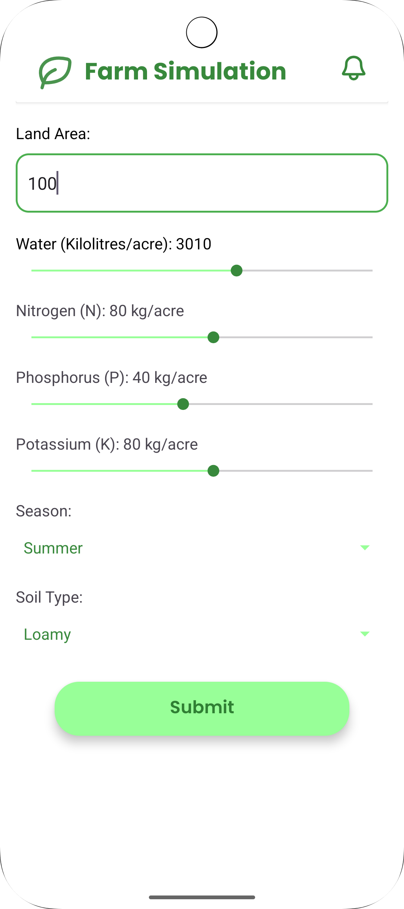
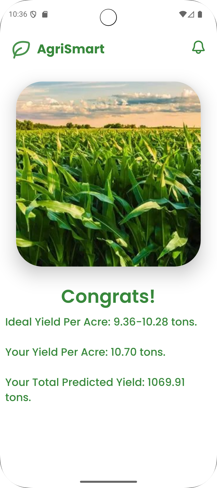

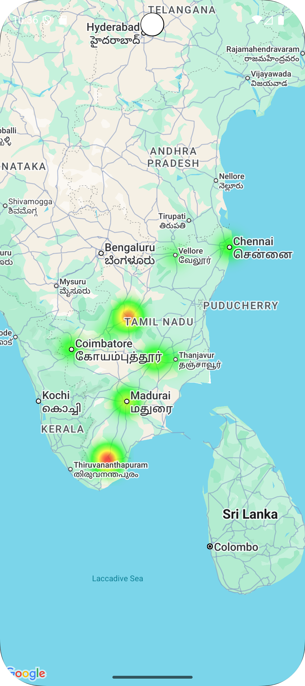
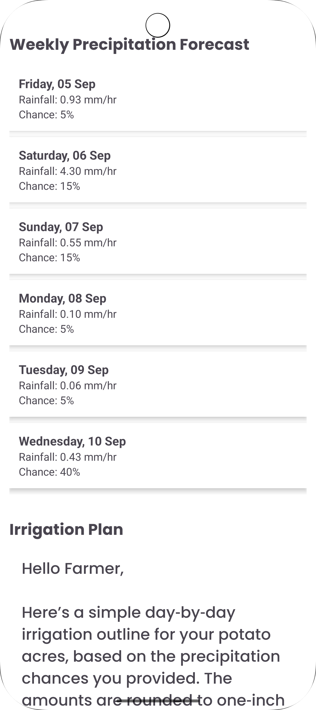
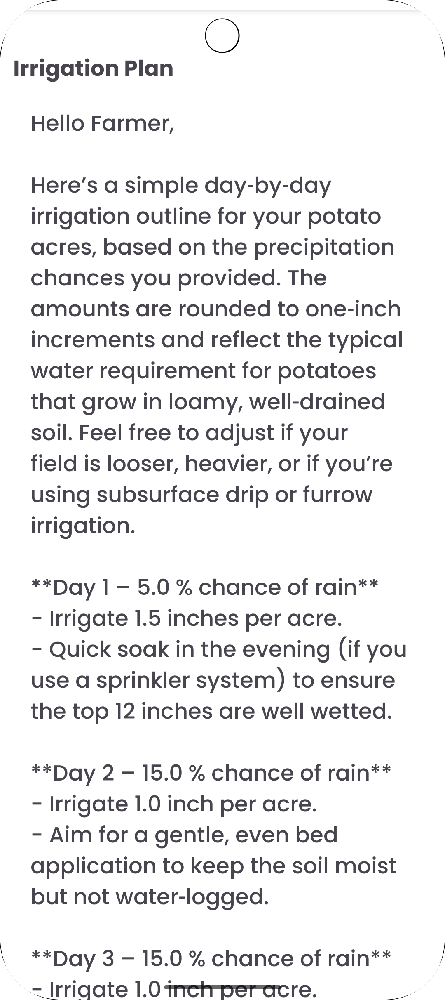
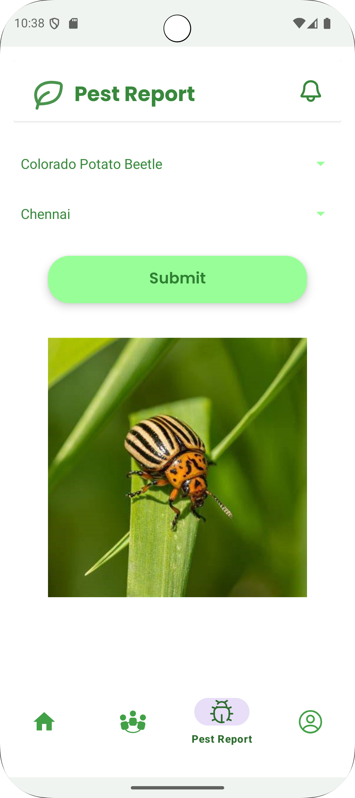

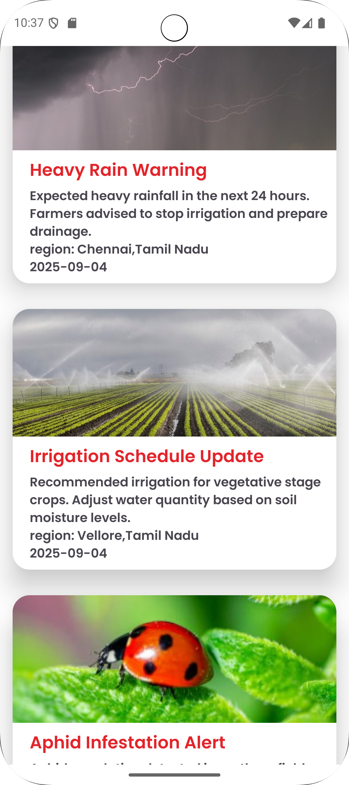
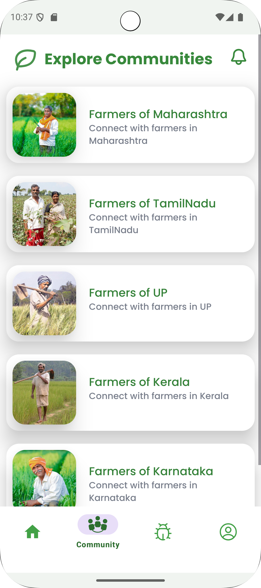

---

### Website Screenshots

<!-- Add more if needed -->

---

## Machine Learning Model Description
The app uses ML models for:
1. **Crop Health Analysis**  
   - NDVI and NDRE indices to identify crop stress  
   - Nutrient maps generated from images  
2. **Disease Detection**  
   - CNN-based image classification to detect crop diseases from leaf images  

Models are trained on publicly available datasets as well as synthetic farm data.  

---

## ML Model Screenshots

<!-- Add more ML screenshots -->

---

